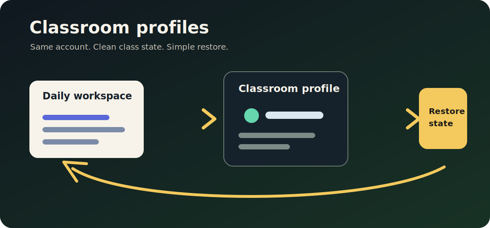
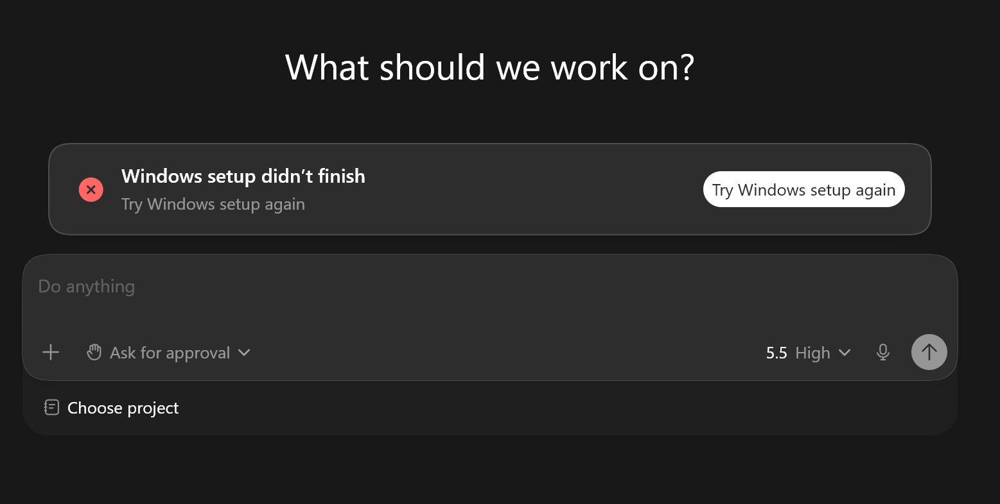
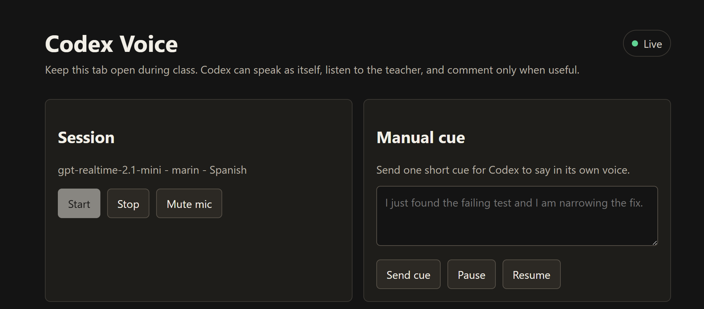

# Teaching Codex without overwhelming the room

I have been teaching more and more classes about the Codex app. Some students are developers. Many are not. That difference matters.

When a technical audience sees a busy Codex workspace, they may read it as evidence. Projects, threads, skills, automations, plugins, and long-running agents signal that the tool can do serious work. A nontechnical audience often sees the same screen and reads it as a warning: this is not for me.

That is the problem I wanted to solve with `codex-classroom`.

It is a small teaching toolkit for making Codex easier to teach live. The tools are experimental. I built them quickly because I needed them for real classes. They are not polished enterprise software. But they have already changed the way I teach.

## Start with an empty room

The first feature is classroom profiles. Before class, I temporarily swap my normal Codex state for a clean class state. The students see a fresh Codex app, not my daily workspace.

That matters because my real Codex environment is full of things that are useful to me and distracting to a beginner. Old chats, active projects, installed skills, plugin setup, automations, and habits are embedded in the interface. For a class, especially a class with people who do not code, all of that becomes noise.

I also want to teach from my Pro account, because that is where I can use Codex the way I actually use it: stronger models, configured plugins, higher limits, subagents, and Fast mode. I want to push the tool hard during class without paying for a second Pro account just to keep the screen clean. In a classroom, speed isn't a luxury. Waiting breaks attention.

The effect is small but powerful. I can start from zero without pretending to be a new user. I can show students the same friction they will see the first time they use Codex: workspace setup, sandbox setup, choosing a project folder, and the first moments of deciding what Codex is allowed to touch.

When that first moment has passed, I can leave the classroom profile and restore my real workspace. That lets me start with a gentle interface and later show the more advanced loops, skills, and automations that I actually use day to day.

## Let Codex speak for itself

The second feature is Codex Voice. Long Codex threads are hard to teach live. A good workshop can easily include a 20 or 30 minute agent run. Codex may inspect a codebase, run commands, hit errors, fix tests, revise files, and check its own work. Codex is useful because it can stay with that whole loop while the teacher and the class think at a higher level. The hard part is helping the room understand what matters while that loop is running.

The students cannot read every update at Codex speed. Many do not know the technical vocabulary yet. Even when they do, a wall of text is a poor classroom interface.

I wanted Codex to speak.

Codex Voice runs on [`gpt-realtime-2.1-mini`](https://developers.openai.com/api/docs/models/gpt-realtime-2.1-mini), OpenAI's low-latency voice and text model. The browser opens a live audio session. A Codex skill sends compact cues about what is happening in the thread, and the model turns those cues into short spoken updates.

The teacher can also talk to it. That part matters. In class, I do not want a one-way audio feed. I want a conversation that includes the professor, Codex, and the room.

Codex Voice can listen while I explain, stay quiet when I ask it to, resume when useful, and answer questions about what is happening in the current thread. A small context bridge gives it a compact view of the work: prompts, commands, tool results, checks, and recent cues. It does not need every token from the thread. It needs the right fragment of context, updated often enough to answer the professor and keep the class oriented.

## Why this matters

Most AI coding demos assume the viewer already knows what matters. A developer can watch a test failure, a dependency install, and a diff review and understand the shape of the work. A beginner may see only motion. The agent is doing many things, the screen is changing, and the vocabulary is unfamiliar.

For nontechnical students, the first job is not to teach every command. It is to make the workflow feel learnable. A quiet first screen lowers the temperature. A spoken companion names the moments the room should notice. Together, they make Codex easier to follow without making the class slower.

That is what `codex-classroom` is for: a practical layer around the Codex app for people who teach live and need the room to stay with the work. I use it in real classes, and I still treat it as experimental classroom infrastructure. Test it before teaching with it, keep a restore path ready, and shape it around the way your class actually learns.

When the interface starts quiet and the important moves are spoken out loud, students can spend less energy decoding the tool and more energy understanding the work.
